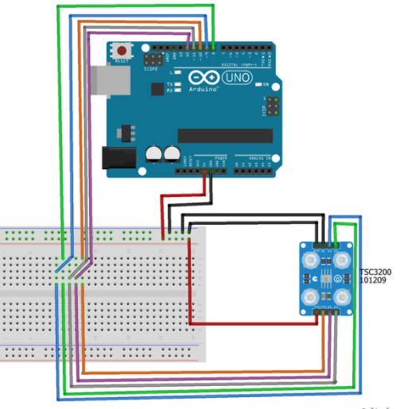

# Sensor De Cor (TCS3200):

 Teste do sensor de cor em Arduino (UNO).
 Este programa tem como funcionalidade exibir a cor no serial monitor conforme a cor detectada pelo sensor.

 - Sensor: TCS3200
 - Arduino: Uno

# Referências:

Link para o site de referência usado neste projeto:
- https://cluberobotica.wordpress.com/2017/11/12/tcs3200/

# Conexões:

